<h1 align="center">Hi 👋, I'm Beckett!</h1>
<h3 align="center">A passionate developer from the United States 😎</h3>

- 🔭 I’m currently working on [Stiive](https://github.com/stiive) and [Creeper](https://github.com/chatter-social/Creeper)

- 👨‍💻 All of my projects are available at [https://github.com/beckettnormington](https://github.com/beckettnormington)

- 💬 Ask me about **anything!**

- 📫 How to reach me: **beckett@chatter-social.com**

- ⚡ Daily (yearly) fact: **The world is spinning at 1,670 kilometers/hour.**

<h3 align="left">Connect with me:</h3>

# Metrics:

# Octocat:

